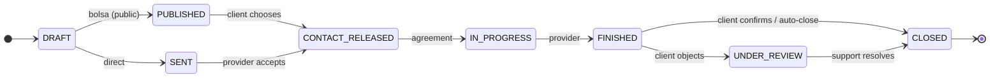

# Specialist API Documentation

> **Base URL**: `/api`  
> **Swagger UI**: `/api/docs` (when running locally)  
> **Version**: 1.0.0

## Overview

The API is organized around REST principles and follows a bounded context architecture:

| Context | Prefix | Description |
|---------|--------|-------------|
| **Identity** | `/auth`, `/users` | Authentication & user management |
| **Profiles** | `/professionals`, `/companies`, `/trades` | Service provider profiles (individual & company) |
| **Requests** | `/requests` | Service requests & job matching |
| **Reputation** | `/reviews` | Reviews & ratings (with moderation) |
| **Notifications** | `/notifications` | In-app & external notifications |
| **Admin** | `/admin` | Administrative operations |
| **Storage** | `/storage` | File uploads & media |
| **Contact** | `/contact` | Contact requests |

---

## Authentication

All protected endpoints require a JWT token in the `Authorization` header:

```
Authorization: Bearer <token>
```

### Public Endpoints (no auth required)
- `POST /auth/register`
- `POST /auth/login`
- `GET /auth/google`, `GET /auth/facebook` (OAuth)
- `GET /professionals` (search)
- `GET /professionals/:id`
- `GET /companies` (search)
- `GET /companies/:id`
- `GET /trades`
- `GET /professionals/:id/reviews`

---

## Endpoints by Context

### 🔐 Identity (`/auth`, `/users`)

| Method | Endpoint | Description | Auth |
|--------|----------|-------------|------|
| `POST` | `/auth/register` | Register new user | ❌ |
| `POST` | `/auth/login` | Login with email/password | ❌ |
| `GET` | `/auth/google` | Initiate Google OAuth | ❌ |
| `GET` | `/auth/facebook` | Initiate Facebook OAuth | ❌ |
| `GET` | `/users/me` | Get current user profile | ✅ |
| `PATCH` | `/users/me` | Update current user profile | ✅ |
| `POST` | `/users/me/client-profile` | Activate client profile | ✅ |

### 📱 Identity - Verification (`/identity/verification`)

Email and phone verification via Twilio Verify (OTP). Required for some actions (e.g. expressing interest, activating provider profile).

| Method | Endpoint | Description | Auth |
|--------|----------|-------------|------|
| `POST` | `/identity/verification/phone/request` | Request phone OTP (SMS) | ✅ |
| `POST` | `/identity/verification/phone/confirm` | Confirm phone with code | ✅ |
| `POST` | `/identity/verification/email/request` | Request email OTP | ✅ |
| `POST` | `/identity/verification/email/confirm` | Confirm email with code | ✅ |

Request body for confirm endpoints: `{ "code": "123456" }`. Phone must be in E.164 format (e.g. `+5492944123456`).

### 👷 Profiles - Professionals (`/professionals`)

| Method | Endpoint | Description | Auth |
|--------|----------|-------------|------|
| `GET` | `/professionals` | Search professionals | ❌ |
| `GET` | `/professionals/:id` | Get professional details | ❌ |
| `GET` | `/professionals/me/profile` | Get my professional profile | ✅ |
| `POST` | `/professionals/me` | Create professional profile | ✅ |
| `PATCH` | `/professionals/me` | Update professional profile | ✅ |
| `POST` | `/professionals/me/gallery` | Add gallery item | ✅ |
| `DELETE` | `/professionals/me/gallery` | Remove gallery item | ✅ |

### 🏢 Profiles - Companies (`/companies`)

| Method | Endpoint | Description | Auth |
|--------|----------|-------------|------|
| `GET` | `/companies` | Search companies (public) | ❌ |
| `GET` | `/companies/:id` | Get company details | ❌ |
| `GET` | `/companies/me/profile` | Get my company profile | ✅ |
| `POST` | `/companies/me` | Create company profile | ✅ |
| `PATCH` | `/companies/me` | Update company profile | ✅ |
| `POST` | `/companies/me/gallery` | Add gallery image | ✅ |
| `DELETE` | `/companies/me/gallery` | Remove gallery image | ✅ |
| `POST` | `/companies/:id/verify` | Verify company (Admin) | ✅ Admin |

> **Note**: Companies and Professionals are both "Service Providers". Both can express interest in public requests and be assigned to jobs. See [ADR-004-SERVICE-PROVIDER-ABSTRACTION](./decisions/ADR-004-SERVICE-PROVIDER-ABSTRACTION.md).

### 📋 Profiles - Unified catalog (`/providers`)

| Method | Endpoint | Description | Auth |
|--------|----------|-------------|------|
| `GET` | `/providers` | Search professionals and companies in one list | ❌ |

Query params: `search`, `tradeId`, `city`, `zone`, `providerType` (`PROFESSIONAL` \| `COMPANY` \| `ALL`). Used by the frontend for the specialist catalog page and when creating a request (choose provider). Returns a unified shape (displayName, trades, averageRating, hasVerifiedBadge, etc.).

### 📦 Profiles - Trades (`/trades`)

| Method | Endpoint | Description | Auth |
|--------|----------|-------------|------|
| `GET` | `/trades` | List all trades | ❌ |
| `GET` | `/trades/:id` | Get trade by ID | ❌ |
| `GET` | `/trades/with-professionals` | Trades with active providers | ❌ |

### 📋 Requests (`/requests`)

| Method | Endpoint | Description | Auth |
|--------|----------|-------------|------|
| `GET` | `/requests` | Get my requests | ✅ |
| `POST` | `/requests` | Create new request | ✅ |
| `GET` | `/requests/available` | Available requests (for providers) | ✅ Provider |
| `GET` | `/requests/:id` | Get request details | ✅ |
| `PATCH` | `/requests/:id` | Update request (status, quote) | ✅ |
| `POST` | `/requests/:id/accept` | Accept quote (client) | ✅ |
| `POST` | `/requests/:id/photos` | Add photo to request | ✅ |
| `DELETE` | `/requests/:id/photos` | Remove photo from request | ✅ |
| `POST` | `/requests/:id/interest` | Express interest (provider) | ✅ Provider |
| `DELETE` | `/requests/:id/interest` | Withdraw interest (keeps the row as `WITHDRAWN`; only while `INTERESTED`) | ✅ Provider |
| `GET` | `/requests/:id/interest` | Check my interest status | ✅ Provider |
| `GET` | `/requests/:id/interests` | List interested providers (`WITHDRAWN` ones are excluded; no `phone`/`whatsapp` — contact only releases once the client chooses one, see `canViewCounterpartContactBy`) | ✅ |
| `POST` | `/requests/:id/assign` | Assign provider (client) | ✅ |

> **Note**: "Provider" = Professional or Company. Both can view available requests, express interest, and be assigned to jobs.

### ⭐ Reputation (`/reviews`)

| Method | Endpoint | Description | Auth |
|--------|----------|-------------|------|
| `POST` | `/reviews` | Create review (status: PENDING) | ✅ |
| `GET` | `/reviews?requestId=xxx` | Get review by request | ✅ |
| `GET` | `/reviews/:id` | Get review by ID | ✅ |
| `PATCH` | `/reviews/:id` | Update review | ✅ |
| `DELETE` | `/reviews/:id` | Delete review | ✅ |
| `GET` | `/professionals/:id/reviews` | Get professional's approved reviews | ❌ |
| `GET` | `/reviews/admin/pending` | Get pending reviews (Admin) | ✅ Admin |
| `POST` | `/reviews/:id/approve` | Approve review (Admin) | ✅ Admin |
| `POST` | `/reviews/:id/reject` | Reject review (Admin) | ✅ Admin |

> **Note**: Reviews are moderated. New reviews have `PENDING` status and only `APPROVED` reviews are visible publicly and count towards the professional's rating. See [Review Moderation Guide](./guides/REVIEW_MODERATION.md).

### 🔔 Notifications (`/notifications`)

| Method | Endpoint | Description | Auth |
|--------|----------|-------------|------|
| `GET` | `/notifications` | List my notifications | ✅ |
| `PATCH` | `/notifications/:id/read` | Mark notification as read | ✅ |
| `PATCH` | `/notifications/read-all` | Mark all as read | ✅ |
| `GET` | `/notifications/preferences` | Get my notification preferences | ✅ |
| `PUT` | `/notifications/preferences` | Update my preferences | ✅ |

> See [Notifications Guide](./guides/NOTIFICATIONS.md) for email configuration and event types.

### 🔧 Admin (`/admin`)

> All admin endpoints require `isAdmin: true` in the JWT token.

| Method | Endpoint | Description |
|--------|----------|-------------|
| `GET` | `/admin/users` | List all users (paginated, optional `search` on email/firstName/lastName, optional `type` = `CLIENT`\|`PROFESSIONAL`\|`COMPANY` to filter by profile). Each item includes `isAdmin`, `hasClientProfile`, `hasProfessionalProfile`, `hasCompanyProfile`, `updatedAt`, `whatsappOptedOut`, `whatsappOptedOutAt` |
| `GET` | `/admin/users/:id` | Get user by ID. Adds `professionalId` and `companyId` (`string \| null`) alongside the user fields — the linked Professional/Company profile's own `id` (not the userId), for linking to `/admin/professionals/:id` / `/admin/companies/:id` |
| `PUT` | `/admin/users/:id/status` | Update user status |
| `PUT` | `/admin/users/:id/verification` | Manually set email/phone verified (body: `{ emailVerified?: boolean, phoneVerified?: boolean }`) |
| `PUT` | `/admin/users/:id/whatsapp-opt-out` | Manually set/clear `User.whatsappOptedOut` (body: `{ whatsappOptedOut: boolean }`). Setting it `true` (from `false`) sends the user a `WHATSAPP_OPTED_OUT` notification (forced to email); clearing it does not notify. No-op if the value is already what was requested |
| `GET` | `/admin/professionals` | List all professionals (paginated) |
| `PUT` | `/admin/professionals/:id/status` | Update professional status |
| `GET` | `/admin/requests` | List all requests (paginated; optional filters `?status=`, `?title=`, `?client=` (name/email), `?provider=` (professional or company name) - text filters are case-insensitive, every word must match). Each item's `provider` is `{ id, type: 'PROFESSIONAL' \| 'COMPANY', name } \| null` |
| `GET` | `/admin/requests/:id` | Full request detail: `client`, `trade`, a unified `provider` (with `trades` for Professional/Company), and `interestedProviders` (`InterestedProfessionalResponseDto[]`). No participant-only ownership check - any admin can view any request |
| `PUT` | `/admin/requests/:id/status` | Update request status. Body: `{ status: RequestStatus, statusReason?: string }` (`RequestStatus` is one of the 15 states, `statusReason` max 500 chars). Admins bypass the normal transition table (`RequestEntity.canChangeStatusBy` grants an unconditional admin bypass), so this can move a request to any status. Response: full `RequestResponseDto` (same shape as `PATCH /requests/:id`), built with an admin viewer context so contact fields are shown |
| `GET` | `/admin/whatsapp/config` | Get `{ devMode, availableFollowUpRules? }` |
| `GET` | `/admin/whatsapp/conversations` | List WhatsApp conversations (paginated, optional `search`) |
| `GET` | `/admin/whatsapp/conversations/:requestId` | Get the full WhatsApp message thread for a request |
| `POST` | `/admin/whatsapp/conversations/:requestId/simulate-reply` | Simulate an inbound WhatsApp reply (dev mode only, 404 otherwise) |
| `POST` | `/admin/whatsapp/conversations/:requestId/trigger-followup` | Force-trigger a follow-up rule right now (dev mode only, 404 otherwise) |
| `POST` | `/admin/requests/:id/resolve-review` | Support flow: resolve a request in `UNDER_REVIEW` (client objected to `FINISHED`), moving it to `CLOSED` as the Soporte actor. Optional body `{ note }` (max 500 chars, stored as `statusReason`). List candidates with `GET /admin/requests?status=UNDER_REVIEW`. 400 if the request is not under review. MVP: admin-only (no dedicated support role yet) |
| `GET` | `/admin/requests/attention` | List open `RequestAttentionFlag`s (paginated, `?page=&limit=`), joined with request title/status. Reasons: `AT_RISK` (follow-up ladder exhausted, request never responded), `ABANDONED` (LLM-detected evasive reply), `ESCALATED` (LLM-detected `escalate`) |
| `POST` | `/admin/requests/attention/:id/resolve` | Mark an attention flag resolved (204). Purely a status change — does not touch the underlying request; the admin follows up manually via the WhatsApp conversations viewer above |
| `GET` | `/admin/support/conversations` | List support conversations (paginated, `?status=OPEN\|RESOLVED\|ALL&page=&limit=`). Each item includes `canReplyNow`, computed server-side from the WhatsApp 24h reply window |
| `GET` | `/admin/support/conversations/:id` | `{ conversation, messages }` — messages chronological (oldest first) |
| `POST` | `/admin/support/conversations/:id/reply` | Send an admin reply (body: `message`, 1-1500 chars). 201 with the created message, or 400 `{ code: 'WHATSAPP_WINDOW_EXPIRED', message, lastInboundAt }` outside the 24h window |
| `POST` | `/admin/support/conversations/:id/resolve` | Mark a support conversation resolved (204, idempotent) |
| `POST` | `/admin/support/conversations/:id/reopen` | Reopen a resolved support conversation (204, idempotent) |

### 📁 Storage (`/storage`)

| Method | Endpoint | Description | Auth |
|--------|----------|-------------|------|
| `POST` | `/storage/upload` | Upload file | ✅ |
| `GET` | `/storage/public/*` | Get public file | ❌ |
| `GET` | `/storage/private/*` | Get private file | ✅ |
| `DELETE` | `/storage/*` | Delete file | ✅ |

### 📞 Contact (`/contact`)

| Method | Endpoint | Description | Auth |
|--------|----------|-------------|------|
| `POST` | `/contact` | Create contact request | ✅ |
| `GET` | `/contact` | Get my contacts | ✅ |

### ❤️ Health (`/health`)

| Method | Endpoint | Description |
|--------|----------|-------------|
| `GET` | `/health` | Basic health check |
| `GET` | `/health/ready` | Readiness check |
| `GET` | `/health/live` | Liveness check |

---

## Common Response Formats

### Success Response
```json
{
  "id": "uuid",
  "field": "value",
  ...
}
```

### Error Response
```json
{
  "statusCode": 400,
  "message": "Error description",
  "error": "Bad Request"
}
```

### Paginated Response
```json
{
  "data": [...],
  "meta": {
    "total": 100,
    "page": 1,
    "limit": 10,
    "totalPages": 10
  }
}
```

---

## Service Providers

The platform supports two types of service providers:

### Professional
An individual service provider with a personal profile.

```json
{
  "id": "uuid",
  "userId": "uuid",
  "serviceProviderId": "uuid",
  "displayName": "Juan Pérez",
  "city": "Bariloche",
  "status": "ACTIVE",
  "trades": [{ "tradeId": "uuid", "name": "Plomería", "isPrimary": true }],
  "averageRating": 4.5,
  "reviewCount": 12
}
```

### Company
A business entity providing services.

```json
{
  "id": "uuid",
  "userId": "uuid",
  "serviceProviderId": "uuid",
  "companyName": "Construcciones Patagonia S.A.",
  "legalName": "Construcciones Patagonia S.A.",
  "taxId": "30-12345678-9",
  "city": "Bariloche",
  "status": "ACTIVE",
  "trades": [{ "tradeId": "uuid", "name": "Construcción", "isPrimary": true }],
  "averageRating": 4.8,
  "reviewCount": 45
}
```

### Company Status

| Status | Description |
|--------|-------------|
| `PENDING` | Newly created, awaiting activation |
| `ACTIVE` | Active and can operate |
| `VERIFIED` | Verified by admin (badge displayed) |
| `SUSPENDED` | Temporarily suspended |

---

## Request Types

### Direct Request
A request sent directly to a specific service provider.

```json
{
  "isPublic": false,
  "professionalId": "uuid",
  "description": "Need help with...",
  "address": "Address 123"
}
```

### Public Request (Job Board)
A request visible to all service providers in a trade.

```json
{
  "isPublic": true,
  "tradeId": "uuid",
  "description": "Looking for...",
  "city": "Bariloche",
  "zone": "Centro"
}
```

---

## Interest Flow

When a public request is created, service providers (professionals or companies) can express interest:

1. **Client** creates a public request
2. **Providers** view available requests via `GET /requests/available`
3. **Provider** expresses interest via `POST /requests/:id/interest`
4. **Client** views interested providers via `GET /requests/:id/interests`
5. **Client** assigns a provider via `POST /requests/:id/assign`: the chosen interest becomes `CHOSEN`, every other open one `NOT_CHOSEN` (rows are kept, not deleted)

Each interest has its own `status` (`RequestInterestStatus`): `INTERESTED` (Interesado), `CHOSEN` (Elegido), `NOT_CHOSEN` (No elegido), `WITHDRAWN` (Retirado). A provider that withdrew can express interest again (the row is reused). `GET /requests/interested` (provider's own list) returns all of them as `interestStatus`.

Request responses include `statusReason` (reason recorded for `NOT_COMPLETED`/`INTERRUPTED`, or a support resolution note; omitted from the limited view for interested-but-unassigned providers). The client's `GET /requests` list also includes `interestsCount`: how many specialists are currently `INTERESTED` (excludes withdrawn / chosen / not chosen).

```json
// Express interest request
{
  "message": "Estoy interesado en este trabajo. Tengo 10 años de experiencia."
}

// Interested provider response
{
  "serviceProviderId": "uuid",
  "status": "INTERESTED", // INTERESTED | CHOSEN | NOT_CHOSEN | WITHDRAWN
  "providerType": "PROFESSIONAL", // or "COMPANY"
  "displayName": "Juan Pérez",
  "message": "...",
  "averageRating": 4.5,
  "reviewCount": 12
}
```

---

## Request Status Flow



Terminal alternates (never reach `CLOSED`): `EXPIRED` (bolsa, nobody chosen), `NO_RESPONSE` (direct, no answer), `REJECTED`, `CANCELLED` (client, before contact release), `NOT_COMPLETED` (no agreement), `INTERRUPTED` (work started, not finished), `ABANDONED` (contact released, nobody answered). Actors: client, provider, system (expirations/auto-close), support (`UNDER_REVIEW`). Full spec: `docs/architecture/EspecialistBRC — Estados del pedido.md`.

---

## Rate Limiting

Currently no rate limiting is implemented. Consider adding for production.

---

## CORS

Configured origins are set via `CORS_ORIGINS` environment variable.

---

## For More Details

Visit the Swagger documentation at `/api/docs` when the server is running.

### Request contact fields (2026-09)

`GET /requests`, `GET /requests/:id` and the mutation endpoints return the counterpart's contact (`client.phone`, `professional.whatsapp`, `professional.user.phone`, `company.phone`/`email`/`user.phone`) only to the client owner and the assigned provider once contact is released (`CONTACT_RELEASED`, `IN_PROGRESS`, `FINISHED`, `UNDER_REVIEW`, `CLOSED`) and to admins; otherwise the fields are `null`/absent.
