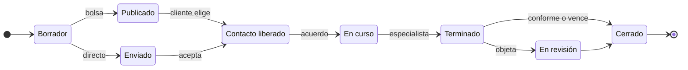

# EspecialistBRC — Estados del pedido

2026-09-21 · @Someone

## Resumen

Cada estado del pedido cumple tres reglas: un solo dueño de la pelota, una sola acción para salir y un vencimiento.

El pedido se crea de dos formas: **público** (bolsa de trabajo, donde los especialistas muestran interés y el cliente elige) o **directo** (el cliente elige a un especialista y le envía la solicitud). Ambos caminos convergen cuando el cliente elige o el especialista acepta: se liberan los datos de contacto y siguen por WhatsApp. Desde ahí, la app solo hace seguimiento con tres preguntas: ¿se pusieron de acuerdo?, ¿terminó? y ¿quedó conforme?

## Estados y transiciones

El camino principal tiene siete estados, más uno transitorio (En revisión) que maneja soporte.

Los estados que terminan sin llegar a Cerrado están en la sección siguiente.

| Estado | Pelota de | Sale cuando | Vence si |
| --- | --- | --- | --- |
| Borrador | Cliente | Lo publica o lo envía | No se toca: se archiva |
| Publicado (bolsa) | Especialistas, luego cliente | El cliente elige a un interesado | Nadie elige en X días: Vencido |
| Enviado (directo) | Especialista | Acepta: Contacto liberado. Rechaza: Rechazado | No responde en X días: Sin respuesta |
| Contacto liberado | Ambos | Se ponen de acuerdo: En curso | No hay acuerdo: No se concretó. Nadie responde: Abandonado |
| En curso | Especialista | Marca terminado: Terminado | Sin novedades: recordatorio |
| Terminado | Cliente | Confirma: Cerrado. Objeta: En revisión | No responde en X días: Cerrado automático |
| En revisión | Soporte | Soporte resuelve: Cerrado | — |
| Cerrado | — | Se habilitan las calificaciones | — |

Los plazos (X días) son parámetros configurables, no valores fijos del diseño.

## Estados finales alternativos

Siete estados cierran un pedido sin que llegue a Cerrado; el cliente puede volver a publicar los que no se concretaron.

| Estado | Cuándo aparece |
| --- | --- |
| Vencido | Nadie eligió a un interesado en la bolsa dentro del plazo |
| Sin respuesta | El especialista no respondió a una solicitud directa |
| Rechazado | El especialista rechazó la solicitud directa |
| Cancelado | El cliente se arrepiente antes de liberar el contacto |
| No se concretó | Hablaron pero no hubo acuerdo (se guarda el motivo) |
| Interrumpido | El trabajo empezó pero no se terminó (se guarda el motivo) |
| Abandonado | Contacto liberado y nadie respondió a los seguimientos |

Si un pedido no se concreta y nadie responde, queda como Abandonado. Si responden, se revisa qué pasó. El cliente puede volver a publicar un pedido que no se concretó.

## Quién puede mover cada cosa

Nadie cierra solo el pedido: el especialista puede marcar que terminó, pero el cierre lo confirma el cliente o lo hace el vencimiento.

| Actor | Puede |
| --- | --- |
| Cliente | Publicar, elegir, cancelar (solo antes de liberar el contacto), confirmar u objetar el terminado, informar que no se concretó o que se interrumpió (ajustado 2026-09-21: el brief de frontend lo permite a ambos roles), volver a publicar |
| Especialista | Marcar interés, aceptar o rechazar, marcar terminado, informar que no se concretó o que se interrumpió |
| Sistema | Aplicar vencimientos, cierre automático y Abandonado |
| Soporte | Resolver los pedidos En revisión |

## Intereses en la bolsa

En un pedido público, cada especialista que muestra interés tiene su propio estado, así el pedido no acumula estados y el cliente ve una lista simple.

- **Interesado:** marcó interés y espera la decisión del cliente.
- **Elegido:** el cliente lo eligió y se libera el contacto.
- **No elegido:** el cliente eligió a otro.
- **Retirado:** el especialista retiró su interés.

## Reputación y estados

La reputación solo se construye en pedidos que llegan a Cerrado, y ese es el diferencial de la app frente a coordinar todo por WhatsApp.

- Solo se califica en Cerrado.
- En No se concretó, Interrumpido, Sin respuesta y Abandonado no se califica el trabajo, pero se guarda el motivo cuando existe, porque sirve para medir tasas de respuesta.
- El cierre automático permite calificar al especialista aunque el cliente no responda.

## Follow-up por WhatsApp: principios

El sistema recorre los pedidos y, según reglas por estado, envía plantillas de WhatsApp; la respuesta libre del usuario cambia el estado del pedido o no. Todo lo que sigue es una propuesta inicial: los valores son parámetros para ajustar.

- **Dos tipos de mensaje.** *Avisos*, que informan y llevan a la app (la acción se hace ahí), y *preguntas*, cuya respuesta puede mover el estado.
- **Una pregunta por mensaje**, que nombra el pedido y a la otra parte.
- **Cada lado responde por separado.**
- **Máximo tres mensajes por estado:** el inicial y dos recordatorios espaciados. Después del último, se aplica la salida por vencimiento del estado.
- **Solo en horario diurno** (propuesta: de 9 a 20 h).
- **Si la respuesta no es clara, el estado no cambia.**

## Follow-up por WhatsApp: reglas por estado

Solo Contacto liberado, En curso y Terminado dependen de preguntas cuya respuesta mueve el estado; en el resto, el mensaje es un aviso y la acción se hace en la app. Los plazos se cuentan desde que el pedido entra al estado.

| Estado | Para | Cuándo | Qué mueve el estado | Si no responde |
| --- | --- | --- | --- | --- |
| Publicado (bolsa) | Cliente | Aviso al primer interesado; recordatorios a los 2 y 4 días si no elige | Elegir, en la app | A los 6 días: Vencido |
| Enviado (directo) | Especialista | Aviso al enviarse; recordatorios a los 2 y 4 días | Aceptar o rechazar, en la app | A los 6 días: Sin respuesta |
| Contacto liberado | Ambos, por separado | Pregunta a los 2 días; recordatorios a los 4 y 6 días | Hay acuerdo: En curso. No hubo acuerdo: No se concretó | Tras el último recordatorio: Abandonado |
| En curso | Especialista | Pregunta a los 7 días y luego cada 7, máximo 3 mensajes | Terminó: Terminado. Se interrumpió: Interrumpido. Sigue: no cambia | Queda En curso y se detiene el seguimiento |
| Terminado | Cliente | Pregunta apenas el especialista marca terminado; recordatorios a los 2 y 4 días | Conforme: Cerrado. Objeta: En revisión | A los 7 días: Cerrado automático |
| Cerrado | Ambos | Aviso apenas se cierra; un recordatorio a los 3 días | Calificar, en la app | No se insiste más |
| Finales sin acuerdo (Vencido, Sin respuesta, Rechazado, No se concretó, Abandonado) | Cliente | Aviso al entrar al estado | Volver a publicar, en la app | — |

En revisión no envía mensajes automáticos: lo maneja soporte.

Por definir: qué se hace con Abandonado cuando el pedido está En curso, y cómo se agrupan los mensajes si una persona tiene varios pedidos en el mismo estado.

## Follow-up por WhatsApp: plantillas

Diez plantillas cubren todos los estados; los recordatorios reutilizan la misma pregunta precedida por «Te escribimos de nuevo por {{pedido}}.» y no requieren plantilla propia.

| Código | Estado | Para | Texto |
| --- | --- | --- | --- |
| A1 | Enviado | Especialista | Hola {{nombre}}, {{cliente}} te envió una solicitud: {{pedido}}. Podés aceptarla o rechazarla acá: {{link}} |
| A2 | Publicado | Cliente | Hola {{nombre}}, {{cantidad}} especialistas se interesaron en tu pedido {{pedido}}. Elegí con quién seguir acá: {{link}} |
| A3 | Contacto liberado | Ambos | Ya podés hablar con {{contraparte}} por WhatsApp sobre {{pedido}}. Sus datos de contacto están acá: {{link}} |
| A4 | Rechazado | Cliente | Hola {{nombre}}, {{especialista}} no puede tomar tu solicitud de {{pedido}}. Podés enviarla a otro especialista o publicarla en la bolsa: {{link}} |
| A5 | Finales sin acuerdo | Cliente | Hola {{nombre}}, tu pedido {{pedido}} quedó como {{estado}}. Si todavía lo necesitás, podés volver a publicarlo: {{link}} |
| A6 | Cerrado | Ambos | Cerramos {{pedido}}. Dejale tu calificación a {{contraparte}} acá: {{link}} |
| A7 | Cerrado automático | Cliente | Como no recibimos tu respuesta, cerramos {{pedido}} como terminado. Si hubo algún problema, avisanos acá: {{link}} |
| P1 | Contacto liberado | Ambos | Hola {{nombre}}, ¿lograste ponerte de acuerdo con {{contraparte}} para {{pedido}}? Contanos cómo va. |
| P2 | En curso | Especialista | Hola {{nombre}}, ¿cómo va el trabajo de {{pedido}} para {{cliente}}? Contanos si ya terminaste, si sigue en curso o si hubo algún problema. |
| P3 | Terminado | Cliente | Hola {{nombre}}, {{especialista}} indicó que terminó {{pedido}}. ¿Quedaste conforme con el trabajo? |

Cada plantilla debe aprobarse en WhatsApp antes de usarse. Las preguntas (P1 a P3) están redactadas para invitar a una respuesta libre, no a un botón.

## Decisiones

**Tomadas**

- La solicitud directa se envía a un especialista por vez; para comparar, se usa la bolsa.
- Los plazos de vencimiento son parámetros, y se ajustan con los primeros usuarios.
- Pausado queda fuera del MVP: En curso alcanza.
- El cliente puede volver a publicar un pedido que no se concretó: se crea un pedido nuevo con los datos copiados y el original queda como historial.
- No hay presupuesto, precio ni chat en la app: la comunicación es por WhatsApp.

**Abiertas**

- Qué pasa con un pedido público cuando no se concreta con el elegido: si vuelve a la bolsa con los demás interesados o el cliente publica de nuevo.
- Criterio exacto de Abandonado: cuántos seguimientos sin respuesta y si aplica también a En curso.
- Si la calificación de un cierre automático pesa igual que la de un cierre confirmado.
