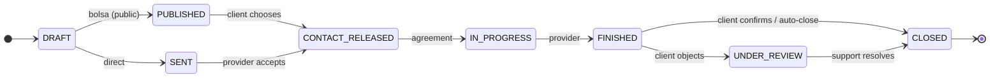

# Arquitectura del Backend - Specialist

## 📋 Índice

1. [Visión General](#visión-general)
2. [Bounded Contexts](#bounded-contexts)
3. [Estructura de Directorios](#estructura-de-directorios)
4. [Diagrama de Dominio](#diagrama-de-dominio)
5. [Flujos Principales](#flujos-principales)
6. [Convenciones](#convenciones)

---

## Overview (English)

This repository follows a Clean Architecture + DDD-inspired structure. For the persistence layer, see:
- `docs/architecture/PERSISTENCE_BOUNDARIES.md`

> Note: parts of this document are still in Spanish and will be progressively migrated to English.

## Visión General

**Specialist** es un marketplace que conecta clientes con profesionales/especialistas verificados. El core del negocio es facilitar la conexión entre quienes necesitan un servicio y quienes lo ofrecen.

### Stack Tecnológico
- **Framework**: NestJS
- **ORM**: Prisma
- **Database**: PostgreSQL (Supabase)
- **Auth**: JWT + OAuth2 (Google, Facebook)
- **Storage**: Local/Cloud files
- **Deploy**: Fly.io

### Arquitectura
- **Patrón**: Clean Architecture + DDD (Domain-Driven Design)
- **Capas por módulo**:
  - `domain/` - Entidades, Value Objects, Interfaces de repositorios
  - `application/` - Servicios, DTOs, casos de uso
  - `infrastructure/` - Implementaciones de repositorios, estrategias
  - `presentation/` - Controllers, Guards específicos

---

## Bounded Contexts

### 1. 🆔 Identity (Identidad y Autenticación)

**Responsabilidad**: Gestionar la identidad del usuario y autenticación.

**Entidades**:
- `User` - Datos básicos del usuario (email, nombre, auth provider)

**Servicios**:
- `AuthenticationService` - Login, registro, OAuth, JWT

**No incluye**: Perfiles de cliente/profesional (eso va en Profiles)

---

### 2. 👥 Profiles (Perfiles)

**Responsabilidad**: Gestionar los perfiles de negocio (Cliente y Profesional).

**Entidades**:
- `Client` - Perfil de cliente (puede crear solicitudes)
- `Professional` - Perfil de especialista (puede recibir/buscar trabajo)

**Value Objects**:
- `Trade` - Oficio/rubro del profesional

**Servicios**:
- `ClientService` - Activar/gestionar perfil de cliente
- `ProfessionalService` - CRUD de perfil profesional, galería
- `TradeService` - Listar oficios disponibles

**Reglas de Negocio**:
- Un User puede tener 0, 1 o ambos perfiles (Client y/o Professional)
- Un Professional debe tener al menos un Trade
- Un Professional puede estar en estados: PENDING_VERIFICATION, VERIFIED, REJECTED

---

### 3. 📋 Requests (Solicitudes de Trabajo)

**Responsabilidad**: Gestionar el ciclo de vida de las solicitudes de trabajo.

**Entidades**:
- `Request` - Solicitud de trabajo (pública o directa)
- `RequestInterest` - Interés de un profesional en una solicitud pública

**Tipos de Request**:
```
┌─────────────────────────────────────────────────────────────┐
│                    TIPOS DE SOLICITUD                       │
├─────────────────────────────────────────────────────────────┤
│                                                             │
│  DIRECTA (isPublic: false)                                  │
│  ─────────────────────────                                  │
│  • Cliente elige un profesional específico                  │
│  • professionalId es requerido                              │
│  • No genera RequestInterest                                │
│                                                             │
│  PÚBLICA (isPublic: true)                                   │
│  ────────────────────────                                   │
│  • Cliente publica para cualquier profesional               │
│  • tradeId es requerido (para filtrar)                      │
│  • Profesionales pueden mostrar interés (RequestInterest)   │
│  • Cliente elige a quién asignar                            │
│                                                             │
└─────────────────────────────────────────────────────────────┘
```

**Estados de Request** (15 estados; detalle en `docs/architecture/EspecialistBRC — Estados del pedido.md`, decisión en `docs/decisions/ADR-006-REQUEST-STATE-MACHINE.md`):


Terminal alternates (never reach `CLOSED`): `EXPIRED` (bolsa, nobody chosen), `NO_RESPONSE` (direct, no answer), `REJECTED`, `CANCELLED` (client, before contact release), `NOT_COMPLETED` (no agreement), `INTERRUPTED` (work started, not finished), `ABANDONED` (contact released, nobody answered). Actors: client, provider, system (expirations/auto-close), support (`UNDER_REVIEW`). Full spec: `docs/architecture/EspecialistBRC — Estados del pedido.md`.

**Servicios**:
- `RequestService` - CRUD, cambios de estado, fotos
- `RequestInterestService` - Expresar interés, listar interesados

---

### 4. ⭐ Reputation (Reputación)

**Responsabilidad**: Gestionar el sistema de reseñas y calificaciones.

**Entidades**:
- `Review` - Reseña de un cliente a un profesional

**Reglas**:
- Solo se puede crear una Review después de que el Request esté CLOSED
- Solo el cliente puede crear la Review
- Un Request solo puede tener una Review

---

### 5. 📁 Storage (Almacenamiento)

**Responsabilidad**: Gestionar archivos (imágenes, documentos).

**Entidades**:
- `File` - Metadata de archivos subidos

**Categorías de Archivos**:
- `PROFILE_PICTURE` - Foto de perfil (pública)
- `PROJECT_IMAGE` - Galería del profesional (pública)
- `REQUEST_PHOTO` - Fotos de solicitudes (acceso controlado)

**Reglas de Acceso**:
```
┌─────────────────────────────────────────────────────────────┐
│                  REGLAS DE ACCESO A ARCHIVOS                │
├─────────────────────────────────────────────────────────────┤
│                                                             │
│  PROFILE_PICTURE, PROJECT_IMAGE                             │
│  → Público (cualquiera puede ver)                           │
│                                                             │
│  REQUEST_PHOTO (solicitud PÚBLICA)                          │
│  → Cualquier usuario logueado                               │
│                                                             │
│  REQUEST_PHOTO (solicitud DIRECTA)                          │
│  → Solo el cliente y el profesional asignado                │
│                                                             │
└─────────────────────────────────────────────────────────────┘
```

---

### 6. 🔐 Admin (Administración)

**Responsabilidad**: Operaciones administrativas.

**Funcionalidades**:
- Verificar/rechazar profesionales
- Suspender/activar usuarios
- Gestión de contenido

---

### 7. 📞 Contact (Contacto)

**Responsabilidad**: Formulario de contacto público.

---

### 8. 🎧 Support (Soporte)

**Responsabilidad**: Canal general de soporte/conversación por WhatsApp, independiente de
cualquier `Request`. Existe como bounded context separado deliberadamente, para que el
clasificador de intención de `requests` nunca corra sobre una conversación humana libre. Ver
`src/support/CLAUDE.md` y `docs/decisions/ADR-005-SUPPORT-CONVERSATIONS.md`.

**Entidades**:
- `SupportConversation` - una fila por número de teléfono, estado `OPEN`/`RESOLVED`,
  `userId`/`relatedRequestId` opcionales sin FK real (soft references).
- `SupportMessage` - mensajes de la conversación, append-only (sin lifecycle).

**Reglas**:
- Un mensaje entrante que no matchea ningún follow-up automático de `requests` se enruta acá
  (flag `SUPPORT_CONVERSATIONS_ENABLED`), en vez de descartarse en silencio.
- Responder desde el panel de admin respeta la ventana real de 24hs de WhatsApp Business API.

---

## Estructura de Directorios

```
src/
├── identity/                       # 🆔 Identidad y Auth
│   ├── domain/
│   │   ├── entities/
│   │   │   └── user.entity.ts
│   │   ├── repositories/
│   │   │   └── user.repository.ts
│   │   └── value-objects/
│   │       └── auth-provider.vo.ts
│   ├── application/
│   │   ├── services/
│   │   │   └── authentication.service.ts
│   │   └── dto/
│   │       ├── login.dto.ts
│   │       ├── register.dto.ts
│   │       └── auth-response.dto.ts
│   ├── infrastructure/
│   │   ├── repositories/
│   │   │   └── prisma-user.repository.ts
│   │   ├── strategies/
│   │   │   ├── jwt.strategy.ts
│   │   │   ├── google.strategy.ts
│   │   │   └── facebook.strategy.ts
│   │   └── guards/
│   │       └── jwt-auth.guard.ts
│   ├── presentation/
│   │   └── auth.controller.ts
│   └── identity.module.ts
│
├── profiles/                       # 👥 Perfiles
│   ├── domain/
│   │   ├── entities/
│   │   │   ├── client.entity.ts
│   │   │   └── professional.entity.ts
│   │   ├── repositories/
│   │   │   ├── client.repository.ts
│   │   │   └── professional.repository.ts
│   │   └── value-objects/
│   │       └── trade.vo.ts
│   ├── application/
│   │   ├── services/
│   │   │   ├── client.service.ts
│   │   │   ├── professional.service.ts
│   │   │   └── trade.service.ts
│   │   └── dto/
│   │       ├── create-professional.dto.ts
│   │       ├── update-professional.dto.ts
│   │       └── search-professionals.dto.ts
│   ├── infrastructure/
│   │   └── repositories/
│   │       ├── prisma-client.repository.ts
│   │       └── prisma-professional.repository.ts
│   ├── presentation/
│   │   ├── client.controller.ts
│   │   ├── professional.controller.ts
│   │   └── trade.controller.ts
│   └── profiles.module.ts
│
├── requests/                       # 📋 Solicitudes
│   ├── domain/
│   │   ├── entities/
│   │   │   ├── request.entity.ts
│   │   │   └── request-interest.entity.ts
│   │   ├── repositories/
│   │   │   ├── request.repository.ts
│   │   │   └── request-interest.repository.ts
│   │   └── value-objects/
│   │       └── request-status.vo.ts
│   ├── application/
│   │   ├── services/
│   │   │   ├── request.service.ts
│   │   │   └── request-interest.service.ts
│   │   └── dto/
│   │       ├── create-request.dto.ts
│   │       ├── update-request.dto.ts
│   │       └── express-interest.dto.ts
│   ├── infrastructure/
│   │   └── repositories/
│   │       ├── prisma-request.repository.ts
│   │       └── prisma-request-interest.repository.ts
│   ├── presentation/
│   │   ├── request.controller.ts
│   │   └── request-interest.controller.ts
│   └── requests.module.ts
│
├── reputation/                     # ⭐ Reputación (sin cambios)
│   └── ...
│
├── storage/                        # 📁 Almacenamiento (sin cambios)
│   └── ...
│
├── admin/                          # 🔐 Administración (sin cambios)
│   └── ...
│
├── contact/                        # 📞 Contacto (sin cambios)
│   └── ...
│
├── shared/                         # 🔗 Compartido
│   ├── domain/
│   │   └── value-objects/
│   │       └── email.vo.ts
│   ├── infrastructure/
│   │   └── prisma/
│   │       ├── prisma.module.ts
│   │       └── prisma.service.ts
│   └── presentation/
│       ├── decorators/
│       │   ├── current-user.decorator.ts
│       │   └── public.decorator.ts
│       └── guards/
│           └── admin.guard.ts
│
├── app.module.ts
└── main.ts
```

---

## Diagrama de Dominio

```
┌─────────────────────────────────────────────────────────────────────────┐
│                              DOMAIN MODEL                                │
├─────────────────────────────────────────────────────────────────────────┤
│                                                                         │
│   ┌─────────────────────────────────────────────────────────────────┐   │
│   │                         IDENTITY                                 │   │
│   │                                                                  │   │
│   │   ┌──────────────────────────────────────────────────────────┐  │   │
│   │   │ User                                                      │  │   │
│   │   │ ────────────────────────────────────────────────────────  │  │   │
│   │   │ id: UUID                                                  │  │   │
│   │   │ email: string (unique)                                    │  │   │
│   │   │ password: string | null                                   │  │   │
│   │   │ firstName: string                                         │  │   │
│   │   │ lastName: string                                          │  │   │
│   │   │ phone: string | null                                      │  │   │
│   │   │ profilePictureUrl: string | null                          │  │   │
│   │   │ authProvider: LOCAL | GOOGLE | FACEBOOK                   │  │   │
│   │   │ googleId: string | null                                   │  │   │
│   │   │ facebookId: string | null                                 │  │   │
│   │   │ status: PENDING | ACTIVE | SUSPENDED | BANNED             │  │   │
│   │   │ isAdmin: boolean                                          │  │   │
│   │   └──────────────────────────────────────────────────────────┘  │   │
│   │                              │                                   │   │
│   └──────────────────────────────│───────────────────────────────────┘   │
│                                  │                                       │
│                                  │ 1:0..1                                │
│                                  ▼                                       │
│   ┌─────────────────────────────────────────────────────────────────┐   │
│   │                         PROFILES                                 │   │
│   │                                                                  │   │
│   │   ┌────────────────────┐         ┌────────────────────────────┐ │   │
│   │   │ Client             │         │ Professional               │ │   │
│   │   │ ──────────────────│         │ ─────────────────────────  │ │   │
│   │   │ id: UUID           │         │ id: UUID                   │ │   │
│   │   │ userId: UUID (FK)  │         │ userId: UUID (FK)          │ │   │
│   │   │ createdAt: Date    │         │ trades: Trade[]            │ │   │
│   │   │                    │         │ description: string        │ │   │
│   │   └────────────────────┘         │ experienceYears: number    │ │   │
│   │            │                     │ status: ProfessionalStatus │ │   │
│   │            │                     │ zone: string               │ │   │
│   │            │                     │ city: string               │ │   │
│   │            │                     │ address: string            │ │   │
│   │            │                     │ whatsapp: string           │ │   │
│   │            │                     │ website: string            │ │   │
│   │            │                     │ gallery: string[]          │ │   │
│   │            │                     │ averageRating: number      │ │   │
│   │            │                     │ totalReviews: number       │ │   │
│   │            │                     │ active: boolean            │ │   │
│   │            │                     └────────────────────────────┘ │   │
│   │            │                                  │                  │   │
│   └────────────│──────────────────────────────────│──────────────────┘   │
│                │                                  │                      │
│                │ crea                             │ recibe/busca         │
│                ▼                                  ▼                      │
│   ┌─────────────────────────────────────────────────────────────────┐   │
│   │                         REQUESTS                                 │   │
│   │                                                                  │   │
│   │   ┌──────────────────────────────────────────────────────────┐  │   │
│   │   │ Request                                                   │  │   │
│   │   │ ────────────────────────────────────────────────────────  │  │   │
│   │   │ id: UUID                                                  │  │   │
│   │   │ clientId: UUID (FK) ────────────────────► Client          │  │   │
│   │   │ professionalId: UUID | null (FK) ───────► Professional    │  │   │
│   │   │ tradeId: UUID | null ───────────────────► Trade           │  │   │
│   │   │ isPublic: boolean                                         │  │   │
│   │   │ description: string                                       │  │   │
│   │   │ address: string | null                                    │  │   │
│   │   │ availability: string | null                               │  │   │
│   │   │ photos: string[]                                          │  │   │
│   │   │ status: DRAFT | PUBLISHED | SENT | ... | CLOSED (15 estados)│  │   │
│   │   │ quoteAmount: number | null                                │  │   │
│   │   │ quoteNotes: string | null                                 │  │   │
│   │   └──────────────────────────────────────────────────────────┘  │   │
│   │                              │                                   │   │
│   │                              │ 1:N (solo si isPublic)            │   │
│   │                              ▼                                   │   │
│   │   ┌──────────────────────────────────────────────────────────┐  │   │
│   │   │ RequestInterest                                          │  │   │
│   │   │ ────────────────────────────────────────────────────────  │  │   │
│   │   │ id: UUID                                                  │  │   │
│   │   │ requestId: UUID (FK) ───────────────────► Request         │  │   │
│   │   │ professionalId: UUID (FK) ──────────────► Professional    │  │   │
│   │   │ message: string | null                                    │  │   │
│   │   │ createdAt: Date                                           │  │   │
│   │   └──────────────────────────────────────────────────────────┘  │   │
│   │                                                                  │   │
│   └──────────────────────────────────────────────────────────────────┘   │
│                              │                                           │
│                              │ después de CLOSED                         │
│                              ▼                                           │
│   ┌─────────────────────────────────────────────────────────────────┐   │
│   │                        REPUTATION                                │   │
│   │                                                                  │   │
│   │   ┌──────────────────────────────────────────────────────────┐  │   │
│   │   │ Review                                                    │  │   │
│   │   │ ────────────────────────────────────────────────────────  │  │   │
│   │   │ id: UUID                                                  │  │   │
│   │   │ requestId: UUID (FK) ───────────────────► Request         │  │   │
│   │   │ clientId: UUID (FK) ────────────────────► Client          │  │   │
│   │   │ professionalId: UUID (FK) ──────────────► Professional    │  │   │
│   │   │ rating: 1-5                                               │  │   │
│   │   │ comment: string                                           │  │   │
│   │   │ createdAt: Date                                           │  │   │
│   │   └──────────────────────────────────────────────────────────┘  │   │
│   │                                                                  │   │
│   └──────────────────────────────────────────────────────────────────┘   │
│                                                                         │
└─────────────────────────────────────────────────────────────────────────┘
```

---

## Flujos Principales

### Flujo 1: Registro y Creación de Perfil Profesional

```
┌──────────┐     ┌──────────┐     ┌────────────────┐     ┌──────────────┐
│ Register │────►│ Verify   │────►│ Create Prof.   │────►│ Admin Review │
│ (User)   │     │ Email    │     │ Profile        │     │ & Verify     │
└──────────┘     └──────────┘     └────────────────┘     └──────────────┘
                                          │
                                          ▼
                                  Status: PENDING_VERIFICATION
                                          │
                                          ▼
                                  Status: VERIFIED / REJECTED
```

### Flujo 2: Solicitud Directa

```
┌────────┐     ┌─────────────┐     ┌──────────────┐     ┌────────┐
│ Client │────►│ Browse      │────►│ Create Direct│────►│ Prof.  │
│        │     │ Professionals│    │ Request      │     │ Quoted │
└────────┘     └─────────────┘     └──────────────┘     └────────┘
                                          │                  │
                                          │                  ▼
                                          │          ┌──────────────┐
                                          │          │ Client       │
                                          │          │ Accepts Quote│
                                          │          └──────────────┘
                                          │                  │
                                          ▼                  ▼
                                  ┌──────────────────────────────┐
                                  │ Work in Progress → Done      │
                                  └──────────────────────────────┘
                                                 │
                                                 ▼
                                         ┌──────────────┐
                                         │ Client       │
                                         │ Leaves Review│
                                         └──────────────┘
```

### Flujo 3: Solicitud Pública

```
┌────────┐     ┌─────────────┐     ┌──────────────────┐
│ Client │────►│ Create      │────►│ Request visible  │
│        │     │ Public Req  │     │ in Job Board     │
└────────┘     └─────────────┘     └──────────────────┘
                                          │
                         ┌────────────────┼────────────────┐
                         ▼                ▼                ▼
                   ┌──────────┐     ┌──────────┐     ┌──────────┐
                   │ Prof. A  │     │ Prof. B  │     │ Prof. C  │
                   │ Interest │     │ Interest │     │ Interest │
                   └──────────┘     └──────────┘     └──────────┘
                         │                │                │
                         └────────────────┼────────────────┘
                                          ▼
                                  ┌──────────────┐
                                  │ Client picks │
                                  │ Professional │
                                  └──────────────┘
                                          │
                                          ▼
                                  (Same as Direct flow)
```

---

## Convenciones

### Naming Conventions

| Tipo | Convención | Ejemplo |
|------|------------|---------|
| Entities | PascalCase + Entity suffix | `UserEntity`, `RequestEntity` |
| DTOs | PascalCase + Dto suffix | `CreateRequestDto` |
| Services | PascalCase + Service suffix | `AuthenticationService` |
| Repositories | Interface: PascalCase + Repository | `UserRepository` |
| | Implementation: Prisma + Name | `PrismaUserRepository` |
| Controllers | PascalCase + Controller suffix | `AuthController` |
| Modules | PascalCase + Module suffix | `IdentityModule` |

### Dependency Injection Tokens

```typescript
// Use string tokens for repositories
export const USER_REPOSITORY = 'USER_REPOSITORY';
export const REQUEST_REPOSITORY = 'REQUEST_REPOSITORY';
```

### Cross-Context Communication (DDD)

**⚠️ IMPORTANT: Repositories must NOT be exported outside their context.**

Bounded contexts must communicate through **Services**, never by directly accessing repositories from other contexts.

```
┌─────────────────┐      ┌─────────────────┐
│ Identity Module │      │ Profiles Module │
│                 │      │                 │
│ UserService ────│─────►│ ClientService   │  ✅ Correct
│ (public API)    │      │                 │
└─────────────────┘      └─────────────────┘

❌ INCORRECT:
┌─────────────────┐      ┌─────────────────┐
│ Other Module    │      │ Identity Module │
│                 │      │                 │
│ SomeService ────│─────►│ UserRepository  │  ❌ DDD Violation
│                 │      │ (internal)      │
└─────────────────┘      └─────────────────┘
```

**Rules:**
1. Each module exports **only Services** (never repositories)
2. Services are the public API of the bounded context
3. An architectural test validates these rules

**Services available for cross-context communication:**

| Context | Service | Public Methods |
|---------|---------|----------------|
| Identity | `UserService` | `findById()`, `findByIdOrFail()`, `update()` |
| Profiles | `ClientService` | `activateClientProfile()`, `getProfile()` |
| Profiles | `ProfessionalService` | `findById()`, `findByUserId()` |
| Profiles | `TradeService` | `findAll()`, `findById()` |
| Requests | `RequestService` | `findById()`, `create()`, `update()` |
| Support | `SupportConversationService` | `receiveInboundMessage()`, `listForAdmin()`, `getForAdmin()`, `replyForAdmin()`, `resolve()`, `reopen()` |

> See ADR-002 for more details about this decision.

### Error Handling

```typescript
// Use NestJS built-in exceptions
throw new NotFoundException('User not found');
throw new BadRequestException('Invalid email format');
throw new ForbiddenException('Access denied');
throw new UnauthorizedException('Invalid credentials');
```

### Testing

```bash
# Run all tests
npm test

# Run specific test file
npm test -- --testPathPattern="authentication"

# Run with coverage
npm test -- --coverage
```

---

## Migration Plan

### Phase 1: Create New Structure
1. Create `identity/` module
2. Create `profiles/` module
3. Create `requests/` module

### Phase 2: Move Files
1. Move User-related files to `identity/`
2. Move Client to `profiles/`
3. Move Professional + Trade to `profiles/`
4. Move Request + RequestInterest to `requests/`

### Phase 3: Update Imports
1. Update all import paths
2. Update module registrations
3. Update tests

### Phase 4: Cleanup
1. Remove old `user-management/` directory
2. Remove old `service/` directory
3. Verify all tests pass

---

## API Endpoints

> Ver documentación completa en [API.md](../API.md)

### Identity (`/auth`, `/users`)
```
POST   /api/auth/register
POST   /api/auth/login
GET    /api/auth/google
GET    /api/auth/facebook
GET    /api/users/me                   # Get current user
PATCH  /api/users/me                   # Update current user
POST   /api/users/me/client-profile    # Activate client profile
```

### Profiles (`/professionals`, `/trades`)
```
GET    /api/professionals              # Search professionals
GET    /api/professionals/:id          # Get professional details
GET    /api/professionals/me/profile   # Get my professional profile
POST   /api/professionals/me           # Create professional profile
PATCH  /api/professionals/me           # Update professional profile
POST   /api/professionals/me/gallery   # Add gallery item
DELETE /api/professionals/me/gallery   # Remove gallery item
GET    /api/trades                     # List all trades
```

### Requests (`/requests`)
```
GET    /api/requests                   # Get my requests
POST   /api/requests                   # Create request
GET    /api/requests/:id               # Get request details
PATCH  /api/requests/:id               # Update request
GET    /api/requests/available         # Get available requests (professionals)
POST   /api/requests/:id/interest      # Express interest
DELETE /api/requests/:id/interest      # Remove interest
GET    /api/requests/:id/interests     # List interested professionals
POST   /api/requests/:id/assign        # Assign professional to request
```

### Reputation (`/reviews`)
```
POST   /api/reviews                    # Create review
GET    /api/reviews?requestId=xxx      # Get review by request
GET    /api/professionals/:id/reviews  # Get professional's reviews
```

---

*Last Updated: December 2024*

